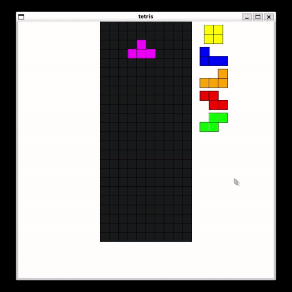

# tetrisplusplus

[SRS Tetris](https://tetris.fandom.com/wiki/SRS) game using C++ SFML.



## Install dependencies

```bash
sudo apt install cmake
sudo apt install libsfml-dev
```

## Build

```bash
git clone git@github.com:evan-howie/tetrisplusplus.git
cd tetrisplusplus
mkdir build && cd build
cmake ..
make
```

## Usage

To run tetrisplusplus, simply run:

```bash
./tetris
```
